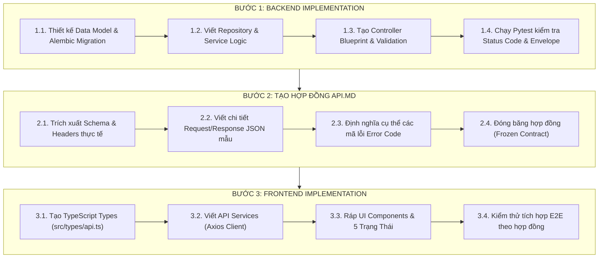

# SAMS Sequential API-Driven Development Workflow

Quy chuẩn kỹ thuật bắt buộc điều phối vòng đời phát triển tính năng trong toàn bộ hệ thống Smart Apartment Management System (SAMS).

---

## 1. Nguyên Tắc Cốt Lõi (Core Principles)

1. **Backend First:** Không bao giờ viết giao diện Frontend khi Backend chưa hoàn thành và chưa vượt qua các bài kiểm thử.
2. **Contract as Single Source of Truth:** Tài liệu `API.md` nằm tại thư mục gốc là **hợp đồng giao tiếp duy nhất** giữa Backend và Frontend.
3. **Zero-Assumption Frontend:** Lập trình viên Frontend (hoặc AI Frontend Agent) tuyệt đối không được tự ý suy đoán endpoint, tự ý đổi tên trường (`field_name`), hoặc tự định nghĩa payload không có trong `API.md`.

---

## 2. Quy Trình 3 Bước Tuần Tự (The 3-Step Pipeline)



---

## 3. Hướng Dẫn Thực Hiện Từng Bước

### Bước 1: Phát Triển Backend (Backend First)

1. **Chuẩn hóa Response Envelope:**
   Mọi endpoint RESTful API BẮT BUỘC trả về cấu trúc Envelope thống nhất:
   ```json
   {
     "success": true,
     "data": { ... },
     "meta": {
       "timestamp": "2026-10-01T12:00:00Z",
       "pagination": { "page": 1, "per_page": 20, "total": 100 }
     },
     "error": null
   }
   ```
   Khi có lỗi xảy ra:
   ```json
   {
     "success": false,
     "data": null,
     "meta": { "timestamp": "2026-10-01T12:00:00Z" },
     "error": {
       "code": "ROOM_ALREADY_OCCUPIED",
       "message": "Phòng 302 hiện đang có khách thuê, không thể tạo hợp đồng mới.",
       "details": { "room_id": 302, "current_tenant": "Nguyen Van A" }
     }
   }
   ```
2. **Kiểm thử tự động:**
   - Viết test suite `pytest tests/api/test_<feature>.py`.
   - Kiểm tra đầy đủ: `200 OK`, `201 Created`, `400 Bad Request`, `401 Unauthorized`, `403 Forbidden`, `404 Not Found`, `422 Unprocessable Entity`.
   - Đảm bảo kiểm tra phân quyền Decorator (`@admin_required`, `@landlord_required`, `@tenant_required`).

---

### Bước 2: Tạo & Cập Nhật Tài Liệu `API.md` (Contract Specification)

> [!TIP]
> **Tự Động Hóa Với Skill `sams-api-doc-generator`:**  
> Bạn không cần phải soạn thảo tài liệu thủ công! Ngay sau khi viết xong code Backend, hãy thực thi script trích xuất tự động:
> ```bash
> python .agents/skills/sams-api-doc-generator/scripts/extract_routes.py
> ```
> Script sẽ tự động quét toàn bộ Blueprints, trích xuất routes, docstrings, quyền truy cập và tự động chèn các endpoints mới vào `API.md`.

Tài liệu `API.md` nằm tại thư mục gốc của dự án (`hethongquanlycanho/API.md`).

Mỗi endpoint trong `API.md` phải tuân thủ khuôn mẫu chuẩn sau:

```markdown
### [METHOD] /api/v1/resource-path

**Mô tả:** Diễn giải ngắn gọn nghiệp vụ của endpoint.  
**Quyền truy cập:** `Public` | `Tenant` | `Landlord` | `Admin`  
**Headers:**
- `Authorization: Bearer <jwt_access_token>` (nếu yêu cầu xác thực)
- `Content-Type: application/json` hoặc `multipart/form-data`

#### 1. Parameters:
- **Path Parameters:**
  - `id` (integer, required): Mã định danh phòng.
- **Query Parameters:**
  - `status` (string, optional): Lọc trạng thái (`vacant`, `occupied`).
  - `page` (integer, default: 1): Trang hiện tại.

#### 2. Request Body Schema (nếu là POST / PUT):
| Tên trường | Kiểu dữ liệu | Bắt buộc | Diễn giải |
| :--- | :--- | :--- | :--- |
| `full_name` | string | Có | Họ và tên người ở |
| `cccd_number` | string | Có | Số Căn cước công dân |
| `phone` | string | Có | Số điện thoại liên hệ |

**Request Payload Mẫu:**
```json
{
  "full_name": "Tran Thi B",
  "cccd_number": "079198000123",
  "phone": "0912345678",
  "vehicle_plate": "59-X1 999.99"
}
```

#### 3. Response Thành Công (200 OK / 201 Created):
```json
{
  "success": true,
  "data": {
    "id": 15,
    "room_id": 302,
    "full_name": "Tran Thi B",
    "temporary_residence_status": "pending",
    "created_at": "2026-10-01T14:30:00Z"
  },
  "meta": { "timestamp": "2026-10-01T14:30:00Z" },
  "error": null
}
```

#### 4. Response Thất Bại Thường Gặp:
- **400 Bad Request:** Thiếu trường bắt buộc hoặc CCCD không đúng 12 chữ số.
- **403 Forbidden:** Khách thuê phòng khác không có quyền xem/sửa phòng này.
- **404 Not Found:** Phòng không tồn tại trong hệ thống.
```

---

### Bước 3: Phát Triển Frontend Dựa Trên `API.md` (Frontend Implementation)

Khi lập trình viên Frontend hoặc AI Agent bắt đầu viết giao diện, phải tuân thủ nghiêm ngặt:

1. **Bước 3.1: Khởi tạo TypeScript Interfaces (`src/types/api.ts`):**
   Copy chính xác cấu trúc schema từ `API.md`:
   ```typescript
   export interface ApiResponse<T> {
     success: boolean;
     data: T | null;
     meta: { timestamp: string; pagination?: PaginationMeta };
     error: ApiError | null;
   }

   export interface ApiError {
     code: string;
     message: string;
     details?: Record<string, unknown>;
   }

   export interface RoommateDTO {
     id: number;
     room_id: number;
     full_name: string;
     cccd_number: string;
     phone: string;
     vehicle_plate?: string;
     temporary_residence_status: 'pending' | 'registered' | 'rejected';
     created_at: string;
   }
   ```

2. **Bước 3.2: Viết API Client Service (`src/services/*.ts`):**
   ```typescript
   import apiClient from './apiClient';
   import { ApiResponse, RoommateDTO } from '@/types/api';

   export const roommateService = {
     getRoommates: async (roomId: number): Promise<ApiResponse<RoommateDTO[]>> => {
       const res = await apiClient.get(`/rooms/${roomId}/roommates`);
       return res.data;
     },
     addRoommate: async (roomId: number, payload: Partial<RoommateDTO>): Promise<ApiResponse<RoommateDTO>> => {
       const res = await apiClient.post(`/rooms/${roomId}/roommates`, payload);
       return res.data;
     }
   };
   ```

3. **Bước 3.3: Ráp Components với UI States:**
   - Xử lý `loading` state (hiển thị skeleton hoặc spinner đạt chuẩn accessibility).
   - Xử lý `error` state (hiển thị message trực tiếp từ `response.error.message`).
   - Xử lý `empty` state khi mảng `data` rỗng.
   - Xử lý `success` state hiển thị dữ liệu chính xác.

---

## 4. Các Điều Cấm Kỵ Tuyệt Đối (Anti-Patterns / Non-Negotiables)

❌ **CẤM:** Viết code giao diện Frontend trước khi Backend hoàn thành.  
❌ **CẤM:** Tự ý đổi casing kiểu dữ liệu (vd: Backend trả `snake_case` như `room_id`, Frontend tự tiện đổi sang `roomId` trong payload gửi lên mà không có layer chuyển đổi).  
❌ **CẤM:** Tự nghĩ ra URL endpoint trong frontend component (ví dụ: gõ thẳng `/api/get-bill` thay vì `/api/v1/billing/my-invoices` đã định nghĩa trong `API.md`).  
❌ **CẤM:** Ẩn hoặc nuốt lỗi từ API; phải luôn bóc tách `error.message` trong Envelope để thông báo rõ ràng cho người dùng.  

---

## 5. Quy Trình Hậu Triển Khai: Tự Động Hóa E2E Testing với Playwright MCP Server & Agent Skill

Sau khi hoàn tất toàn bộ các tính năng của dự án (cả Backend và Frontend), đội ngũ phát triển và các Agent BẮT BUỘC tiến hành kiểm thử tự động hóa đầu-cuối (E2E Test) trên trình duyệt thực tế thông qua **Playwright MCP Server** và **Playwright Agent Skill**.

### 5.1. Cài đặt Playwright MCP Server
Thêm cấu hình sau vào file thiết lập MCP Servers của hệ thống (`mcp_config.json` hoặc cấu hình Agent Host):
```json
{
  "mcpServers": {
    "playwright": {
      "command": "npx",
      "args": ["@playwright/mcp@latest"]
    }
  }
}
```

### 5.2. Cài đặt Playwright CLI Agent Skill
Thực thi lệnh CLI sau để cài đặt bộ công cụ skill agent cho Playwright:
```bash
playwright-cli install --skills=agents
```

### 5.3. Checklist Kiểm thử Tự động Hóa E2E
Agent sử dụng công cụ Playwright để tự động thao tác trên trình duyệt, kiểm tra:
1. **Luồng Khách thuê:**
   - Truy cập `/rooms/search` $\rightarrow$ lọc giá $\rightarrow$ xem chi tiết phòng trống.
   - Đăng ký tài khoản mới $\rightarrow$ Đăng nhập $\rightarrow$ Vào trang quản lý phòng.
   - Thêm thành viên ở cùng trong modal Roommates.
   - Tải ảnh công tơ điện nước $\rightarrow$ Kiểm tra kết quả OCR.
   - Mở hóa đơn $\rightarrow$ Kiểm tra mã VietQR hiển thị đầy đủ, sắc nét $\rightarrow$ Tải ảnh biên lai chuyển khoản.
   - Nhắn tin với Chatbot Gemini $\rightarrow$ Kiểm tra streaming và action card.
2. **Luồng Chủ nhà:**
   - Đăng nhập quyền `landlord` $\rightarrow$ Mở modal tạo hóa đơn nhanh $\rightarrow$ Tải ảnh đồng hồ $\rightarrow$ Phát hành hóa đơn.
   - Gửi cảnh báo vi phạm tới phòng $\rightarrow$ Kiểm tra tiền phạt được ghi nhận vào kỳ tới.
   - Kiểm tra Dashboard Lợi nhuận Ròng (Recharts).
3. **Thẩm định Quy chuẩn Thiết kế Anti-AI-slop:**
   - Kích thước touch target $\ge 44$px cho mobile.
   - Đảm bảo hiển thị đầy đủ 5 trạng thái giao diện (`idle`, `hover`, `active`, `disabled`, `loading/skeleton`).
  
