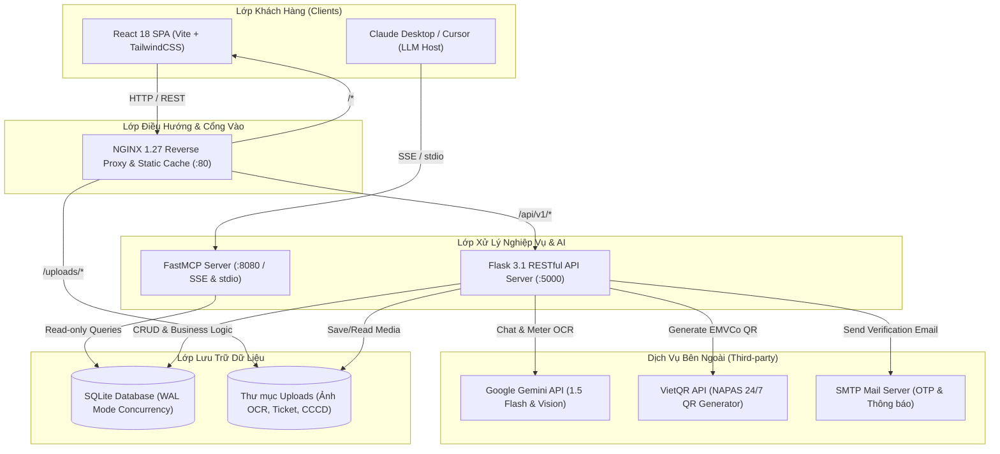

[Uploading README.md…]()
# 🏢 SAMS — Smart Apartment Management System
### Hệ Thống Quản Lý Căn Hộ Cho Thuê Tích Hợp Trí Tuệ Nhân Tạo

[](https://python.org)
[](https://flask.palletsprojects.com/)
[](https://react.dev/)
[](https://vitejs.dev/)
[](https://tailwindcss.com/)
[](https://sqlite.org/)
[](https://ai.google.dev/)
[](https://modelcontextprotocol.io/)
[](https://www.docker.com/)

---

## 📖 Giới Thiệu Tổng Quan

**SAMS (Smart Apartment Management System)** là giải pháp chuyển đổi số toàn diện cho mô hình **căn hộ dịch vụ, nhà trọ và chung cư mini cho thuê**. Dự án kết hợp chặt chẽ giữa **quy trình nghiệp vụ thực tế chuyên sâu** và **công nghệ Trí tuệ Nhân tạo thế hệ mới (Generative AI & Vision OCR & Model Context Protocol)**.

### ✨ Điểm nổi bật của hệ thống
- ⚡ **Nghiệp vụ vận hành trọn vẹn:** Quản lý phòng/tòa nhà, hợp đồng thuê, bàn giao tài sản, ghi nhận cư dân (roommates), quản lý chi phí vận hành (OpEx), xử lý vi phạm nội quy và quy trình trả phòng quyết toán cọc (deposit refund).
- 📸 **Gemini Vision OCR Điện - Nước:** Khách thuê hoặc quản lý chỉ cần chụp ảnh mặt đồng hồ điện/nước, hệ thống tự động bóc tách chỉ số với độ chính xác cao, loại bỏ hoàn toàn việc nhập liệu thủ công.
- 💬 **Trợ lý ảo AI Khách thuê 24/7:** Tích hợp Google Gemini với kỹ thuật **Function Calling** giúp giải đáp nội quy, tra cứu số tiền nợ, hướng dẫn thanh toán và tự động gửi phiếu yêu cầu sửa chữa (Ticket).
- 💳 **Thanh toán VietQR động chuẩn NAPAS247:** Tạo mã QR thanh toán ngân hàng tự động kèm số tiền và nội dung chuyển khoản mã hóa riêng biệt cho từng hóa đơn, hỗ trợ xác nhận thanh toán tức thì.
- 🤖 **Model Context Protocol (MCP) Server cho Chủ nhà:** Cung cấp 9 công cụ phân tích thời gian thực cho các **LLM Hosts** (Claude Desktop, Cursor, Antigravity) để truy vấn doanh thu, phòng nợ quá hạn, kiểm kê tài sản và đề xuất quản trị bằng ngôn ngữ tự nhiên.
- 🛡️ **Bảo mật & Hiệu năng cao:** Mật khẩu băm chuẩn **Argon2id**, JWT Token xác thực đa tầng, phân quyền theo vai trò (**RBAC: Admin, Landlord, Tenant**), SQLite cấu hình **WAL Mode** đa luồng đọc không khóa ghi.

---

## 🏛️ Kiến Trúc Hệ Thống (System Architecture)



---

## 🛠️ Công Nghệ Sử Dụng (Tech Stack)

| Thành phần | Công nghệ / Thư viện chính | Vai trò / Đặc tả |
| :--- | :--- | :--- |
| **Backend** | Python 3.12, Flask 3.1.0, Gunicorn 23.0 | RESTful API Server theo mô hình Clean Architecture & Repository Pattern |
| **ORM & DB** | Flask-SQLAlchemy 3.1.1, SQLAlchemy 2.0, SQLite (WAL Mode) | Lưu trữ quan hệ ACID, hỗ trợ concurrent reads |
| **Bảo mật & Auth** | Argon2-cffi, Flask-JWT-Extended, Marshmallow | Mã hóa mật khẩu chuẩn công nghiệp, xác thực JWT, RBAC phân quyền |
| **Frontend** | React 18, Vite 5, TailwindCSS 3.4, React Router 6 | Giao diện Single Page Application (SPA), thiết kế Responsive |
| **State & Data Fetching** | Zustand, TanStack Query v5 (React Query) | Quản lý state toàn cục & cache dữ liệu server |
| **UI Components** | Lucide React, Recharts, React Hook Form, React Hot Toast | Biểu đồ trực quan, icon hiện đại, form validation |
| **Trí tuệ nhân tạo (AI)** | Google Generative AI SDK (`google-generativeai`) | Gemini 1.5 Flash Chatbot (Function Calling) & Vision OCR công tơ |
| **MCP Server** | FastMCP 0.4+ (Model Context Protocol) | Cung cấp 9 tools phân tích dữ liệu cho Claude Desktop & LLM Agents |
| **Thanh toán** | Chuẩn VietQR / NAPAS 24/7 | Tạo mã QR động kèm số tiền và cú pháp hóa đơn tự động |
| **Container & Proxy** | Docker, Docker Compose, NGINX Alpine | Đóng gói micro-services và thiết lập reverse proxy cân bằng tải |

---

## 📂 Cấu Trúc Dự Án (Project Structure)

```text
hethongquanlycanho/
├── .env.example                     # Mẫu cấu hình biến môi trường
├── docker-compose.yml               # Cấu hình khởi chạy 4 containers
├── API.md                           # Đặc tả chi tiết 100% REST API Endpoints
├── SRS.md                           # Bản đặc tả yêu cầu phần mềm đầy đủ
├── DESIGN_SYSTEM_RULES.md           # Quy chuẩn phong cách thiết kế UI/UX
├── THONG_TIN_DANG_NHAP_SEED_DATA.txt# Danh sách tài khoản đăng nhập mẫu
│
├── backend/                         # Source code Flask API
│   ├── app/
│   │   ├── api/                     # Controller / Blueprints (auth, rooms, billing, tickets, chat...)
│   │   ├── models/                  # SQLAlchemy Models (User, Room, Contract, Invoice, Expense...)
│   │   ├── repositories/            # Repository Pattern trừu tượng hóa thao tác DB
│   │   ├── services/                # Business logic, AI Vision, VietQR, Email, Auth
│   │   ├── utils/                   # Decorators, Validators, Response helpers
│   │   └── extensions.py            # Khởi tạo db, jwt, cors, migrate
│   ├── instance/                    # Nơi lưu database SQLite (apartment.db)
│   ├── scripts/
│   │   ├── init_db.py               # Script tạo schema và tài khoản Admin ban đầu
│   │   └── seed_demo.py             # Script nạp dữ liệu mẫu thực tế người Việt 100%
│   ├── tests/                       # Unit tests và Integration tests với pytest
│   ├── Dockerfile                   # Docker build cho backend (Python 3.12-slim)
│   ├── requirements.txt             # Danh sách dependencies backend
│   └── run.py                       # Điểm vào khởi chạy server
│
├── frontend/                        # Source code React SPA
│   ├── public/                      # Static assets, logos, favicon
│   ├── src/
│   │   ├── components/              # Shared components (Navbar, Sidebar, Modals, VietQRModal...)
│   │   ├── hooks/                   # Custom React Hooks
│   │   ├── lib/                     # Axios instance, formatting utilities
│   │   ├── pages/                   # Các trang giao diện (Auth, Dashboard, Rooms, Invoices, Tickets...)
│   │   ├── services/                # API client functions kết nối backend
│   │   ├── stores/                  # Zustand stores (authStore, themeStore)
│   │   ├── App.jsx                  # Root router & query client config
│   │   └── main.jsx                 # Entrypoint của React
│   ├── Dockerfile                   # Multi-stage Dockerfile cho Frontend
│   ├── package.json                 # Node dependencies
│   ├── tailwind.config.js           # Cấu hình màu sắc, theme theo Design System
│   └── vite.config.js               # Cấu hình build Vite
│
├── mcp_server/                      # Server Model Context Protocol (FastMCP)
│   ├── resources/                   # Tài nguyên MCP (danh mục phòng, hợp đồng)
│   ├── tools/                       # Các hàm phân tích tài chính, bảo trì, thống kê
│   ├── server.py                    # Khởi tạo FastMCP Server với 9 công cụ
│   ├── requirements.txt             # FastMCP dependencies
│   └── Dockerfile                   # Docker container cho MCP Server
│
├── infrastructure/
│   └── nginx/                       # Cấu hình Reverse Proxy NGINX
│       └── nginx.conf
│
└── scripts/                         # Các script kiểm thử tự động E2E (Playwright)
    ├── test_e2e_playwright.py       # Kiểm thử tự động luồng đăng nhập, tạo hóa đơn, ticket
    └── verify_otp_live.py           # Kiểm thử luồng gửi và xác minh OTP
```

---

## 🚀 Hướng Dẫn Cài Đặt & Khởi Chạy

### 1. Chuẩn bị môi trường (Prerequisites)
- **Git** đã được cài đặt.
- **Docker & Docker Compose** (Khuyến khích - phiên bản 24.0+).
- *Hoặc nếu chạy trực tiếp trên máy không dùng Docker:*
  - **Python 3.12+**
  - **Node.js 18+ & npm**

---

### 2. Thiết lập biến môi trường (.env)
Sao chép file `.env.example` thành `.env` tại thư mục gốc:

```bash
cp .env.example .env
```

Mở file `.env` và cập nhật các thông số cần thiết:
```ini
# Khóa bí mật JWT
SECRET_KEY=sams_super_secret_jwt_key_2026_xyz987654321

# Google Gemini API (Bắt buộc để sử dụng Chatbot AI và OCR công tơ điện nước)
GEMINI_API_KEY=your_actual_gemini_api_key_here

# Cấu hình nhận thanh toán VietQR
VIETQR_BANK_BIN=970436               # 970436: Vietcombank (hoặc mã BIN ngân hàng bạn dùng)
VIETQR_ACCOUNT_NUMBER=9867542585     # Số tài khoản ngân hàng thụ hưởng
VIETQR_ACCOUNT_NAME=PHUNG THIEN TRUONG   # Tên chủ tài khoản (In hoa không dấu)

# Cấu hình Email gửi OTP (Nếu có test tính năng quên mật khẩu)
SMTP_HOST=smtp.gmail.com
SMTP_PORT=587
SMTP_USER=your_email@gmail.com
SMTP_PASSWORD=your_app_password
```

---

### 3. Cách 1: Khởi chạy bằng Docker Compose (Khuyên Dùng)

Chỉ với **1 câu lệnh duy nhất**, toàn bộ 4 dịch vụ (`NGINX`, `Backend Flask`, `Frontend React`, `MCP Server`) sẽ được đóng gói và vận hành độc lập:

```bash
docker compose up -d --build
```

**Khởi tạo cơ sở dữ liệu và nạp dữ liệu mẫu ban đầu (Seed Data):**
```bash
# 1. Tạo cấu trúc bảng và tài khoản Admin
docker exec -it sams_backend python scripts/init_db.py

# 2. Nạp toàn bộ dữ liệu mẫu thực tế (Tòa nhà, phòng, hợp đồng, cư dân, hóa đơn, sự cố)
docker exec -it sams_backend python scripts/seed_demo.py
```

**Địa chỉ truy cập dịch vụ:**
- 🌐 **Giao diện Web (SPA):** [http://localhost:3000](http://localhost:3000) (hoặc qua NGINX [http://localhost](http://localhost))
- 🔌 **Backend REST API:** [http://localhost:5000/api/v1](http://localhost:5000/api/v1) (Kiểm tra sức khỏe: `http://localhost:5000/health`)
- 🤖 **FastMCP Server:** [http://localhost:8080](http://localhost:8080)

---

### 4. Cách 2: Khởi chạy thủ công trên máy cục bộ (Local Development)

Nếu muốn debug trực tiếp mã nguồn không qua Docker:

#### A. Khởi chạy Backend (Flask)
```bash
cd backend

# 1. Tạo và kích hoạt môi trường ảo Python
python -m venv .venv

# Trên Windows (PowerShell):
.venv\Scripts\Activate.ps1
# Trên Linux / macOS:
source .venv/bin/activate

# 2. Cài đặt các gói phụ thuộc
pip install -r requirements.txt

# 3. Tạo schema database và seed tài khoản ban đầu
python scripts/init_db.py
python scripts/seed_demo.py

# 4. Khởi động Flask Server
python run.py
# Backend sẽ chạy tại: http://127.0.0.1:5000
```

#### B. Khởi chạy Frontend (React + Vite)
Mở một cửa sổ Terminal mới:
```bash
cd frontend

# 1. Cài đặt dependencies
npm install

# 2. Khởi chạy Vite Dev Server
npm run dev
# Giao diện sẽ chạy tại: http://localhost:3000
```

#### C. Khởi chạy FastMCP Server (Nếu cần kết nối AI Host)
Mở một cửa sổ Terminal khác:
```bash
cd mcp_server
pip install -r requirements.txt
python server.py
```

---

## 🔑 Tài Khoản Đăng Nhập Mẫu (Seed Accounts)

Hệ thống được chuẩn hóa sẵn 100% dữ liệu danh tính người Việt thực tế cho mục đích trình diễn và kiểm thử:

| STT | Username | Password | Vai trò (Role) | Họ và tên | Phạm vi / Phòng |
| :---: | :--- | :--- | :---: | :--- | :--- |
| **1** | `admin` | `Admin@SAMS2024!` | **admin** | Quản trị viên Hệ thống | Toàn quyền kiểm soát hệ thống |
| **2** | `landlord1` | `password123` | **landlord** | Phạm Quốc Dũng | Quản lý Tòa nhà SAMS Him Lam |
| **3** | `tenant1` | `password123` | **tenant** | Nguyễn Mai Anh | Khách thuê **Phòng 101** |
| **4** | `tenant2` | `password123` | **tenant** | Lê Hoàng Nam | Khách thuê **Phòng 102** |
| **5** | `tenant3` | `password123` | **tenant** | Võ Minh Trí | Khách thuê **Phòng 201** |
| **6** | `tenant4` | `password123` | **tenant** | Bùi Phương Thảo | Khách thuê **Phòng 202** |

> 💡 Xem thông tin chi tiết từng phòng, ngày ký hợp đồng, chỉ số đồng hồ điện nước tại [`THONG_TIN_DANG_NHAP_SEED_DATA.txt`](file:///c:/Users/kaedee206/Documents/hethongquanlycanho/THONG_TIN_DANG_NHAP_SEED_DATA.txt).

---

## 🤖 Tích Hợp AI & Model Context Protocol (MCP)

### 1. Trợ lý ảo AI Khách thuê (Gemini Flash & Function Calling)
- Nút chat nổi góc phải màn hình của Khách thuê.
- Hỗ trợ trả lời tự động các câu hỏi:
  - *"Hóa đơn tháng này của tôi là bao nhiêu?"*
  - *"Nội quy tòa nhà về nuôi thú cưng như thế nào?"*
  - *"Bồn rửa bát phòng tôi bị rò nước, hãy tạo yêu cầu sửa giúp tôi."* $\rightarrow$ AI tự động kích hoạt function `create_ticket` để tạo phiếu sửa chữa vào cơ sở dữ liệu.

### 2. Trợ lý Gemini Vision OCR
- Khách thuê tải lên hình ảnh chụp đồng hồ điện / nước tại mục **Gửi số điện nước**.
- Mô hình **Gemini 1.5 Flash Vision** tự động nhận dạng:
  - Loại đồng hồ (Điện / Nước).
  - Số công tơ hiện hành.
  - Cảnh báo bất thường nếu chỉ số thấp hơn chỉ số kỳ trước.

### 3. Kết nối MCP Server với Claude Desktop
Dành cho Chủ căn hộ muốn dùng **Claude Desktop** quản lý và phân tích doanh thu tòa nhà:
Thêm cấu hình sau vào file `claude_desktop_config.json`:

```json
{
  "mcpServers": {
    "sams-apartment": {
      "command": "python",
      "args": [
        "c:/Users/kaedee206/Documents/hethongquanlycanho/mcp_server/server.py"
      ],
      "env": {
        "PYTHONPATH": "c:/Users/kaedee206/Documents/hethongquanlycanho/backend"
      }
    }
  }
}
```

**Các câu lệnh mẫu có thể hỏi Claude:**
- *"Tháng này tòa nhà thu được bao nhiêu tiền doanh thu?"* (`get_monthly_revenue`)
- *"Những phòng nào đang nợ tiền quá hạn trên 5 ngày?"* (`get_overdue_invoices`)
- *"Hiện tại còn bao nhiêu phòng trống và giá thuê thế nào?"* (`get_room_status_summary`)
- *"Hãy tính toán số tiền hoàn cọc dự kiến cho hợp đồng phòng 101 khi trả phòng vào ngày mai?"* (`calculate_refund_estimate`)

---

## 🧪 Kiểm Thử Hệ Thống (Testing)

### 1. Chạy Backend Unit & Integration Tests (pytest)
```bash
cd backend
pytest -v --cov=app --cov-report=term-missing
```

### 2. Chạy E2E Tests với Playwright
Hệ thống đi kèm bộ kiểm thử tự động hành vi người dùng trên trình duyệt:
```bash
# Cài đặt playwright nếu chưa có
pip install playwright
playwright install

# Chạy kiểm thử toàn bộ luồng nghiệp vụ chính
python scripts/test_e2e_playwright.py

# Chạy kiểm thử xác thực OTP
python scripts/test_otp_e2e_playwright.py
```

---

## 📚 Tài Liệu Kỹ Thuật Chi Tiết (Documentation)

Dự án cung cấp hệ thống tài liệu tiêu chuẩn kỹ thuật đầy đủ:
- 📑 [**SRS.md**](file:///c:/Users/kaedee206/Documents/hethongquanlycanho/SRS.md): Bản đặc tả yêu cầu phần mềm đầy đủ theo tiêu chuẩn ISO/IEC/IEEE 29148.
- 📡 [**API.md**](file:///c:/Users/kaedee206/Documents/hethongquanlycanho/API.md): Tài liệu đặc tả 100% RESTful API Endpoints (Headers, Requests, Responses, Error codes).
- 🎨 [**DESIGN_SYSTEM_RULES.md**](file:///c:/Users/kaedee206/Documents/hethongquanlycanho/DESIGN_SYSTEM_RULES.md): Nguyên tắc thiết kế UI/UX, bảng màu, typography và micro-interactions.
- 📋 [**THONG_TIN_DANG_NHAP_SEED_DATA.txt**](file:///c:/Users/kaedee206/Documents/hethongquanlycanho/THONG_TIN_DANG_NHAP_SEED_DATA.txt): Danh mục chi tiết tài khoản người dùng và kịch bản demo.

---

## 👥 Đội Ngũ Phát Triển (Authors)

- **Phùng Thiên Trường** — *Lead Backend & AI Protocol Engineer*
- **Đinh Hoàng An** — *Fullstack UI/UX & DevOps Engineer*

---

## 📄 Bản Quyền (License)

Dự án phát triển phục vụ mục đích nghiên cứu, học tập và triển khai thực tế giải pháp quản lý căn hộ dịch vụ thông minh. Mọi quyền được bảo lưu © 2026 SAMS Team.
